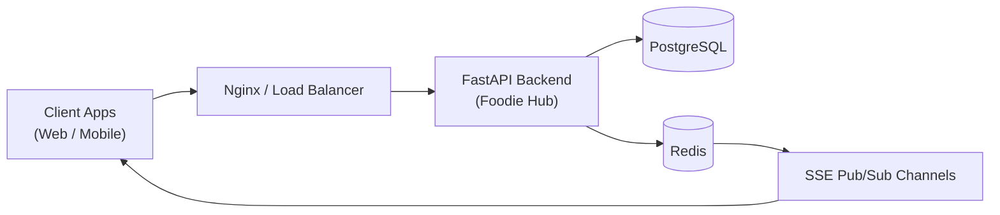

# Foodie Hub Backend

[](https://github.com/Mohammed-Saajid/foodie-hub/actions/workflows/ci.yml)
[](https://www.python.org/downloads/)
[](https://codecov.io/gh/Mohammed-Saajid/foodie-hub)
[](./LICENSE)

A high-performance, asynchronous RESTful API built with FastAPI. This service powers a multi-role food ordering platform, providing distinct authentication workflows, real-time order tracking, and robust data integrity for Consumers, Delivery Partners, Hotel Managers, and Administrators.

## Core Capabilities

* **Role-Based Access Control (RBAC):** Secure JWT authentication tailored for four isolated user domains.
* **Real-Time Telemetry:** Server-Sent Events (SSE) backed by Redis for live order status broadcast and targeted notifications.
* **High-Concurrency Architecture:** Fully asynchronous execution utilizing FastAPI, asyncpg, and Redis, designed to handle traffic spikes.
* **Automated Data Validation:** Strict request/response contracts enforced via Pydantic v2.
* **Developer Ergonomics:** Automated API documentation (Swagger/ReDoc), Dockerized environments, and comprehensive CI/CD pipelines.

## Architecture Overview



## Technology Stack

**Application Core:** Python 3.11+, FastAPI, Pydantic v2
**Data Layer:** PostgreSQL, SQLAlchemy (async), Alembic
**Caching & Messaging:** Redis, sse-starlette
**Quality Assurance:** Pytest, pytest-asyncio, HTTPX, k6 (Load Testing)
**DevOps & Tooling:** Docker, GitHub Actions, Ruff, Mypy, uv (Dependency Management)

## Project Structure

```text
app/
    api/            # Route definitions and API dependencies
    core/           # Config, security, middleware, logging, sessions
    models/         # SQLAlchemy models and enums
    repositories/   # Data access layer
    schemas/        # Request/response contracts
    services/       # Business logic
    main.py         # FastAPI entrypoint
alembic/            # Database migration scripts
tests/              # Unit, integration, and load tests
docs/               # Feature docs (SSE, Benchmarks)
```

## Environment Configuration

Copy the example configuration file to establish your local environment:

```bash
cp .env.example .env
```

## Local Development (Quick Start)

**1. Install dependencies via uv**
```bash
uv sync --dev
```

**2. Initialize the database schema**
```bash
uv run alembic upgrade head
```
*(Optional: For a temporary SQLite database, use `ALEMBIC_DATABASE_URL=sqlite+aiosqlite:///./alembic_local.db uv run alembic upgrade head`)*

`AUTO_CREATE_TABLES` defaults to `false` to avoid conflicts with Alembic. Enable it only for temporary/local bootstrap workflows.

**3. Launch the ASGI server**
```bash
uv run uvicorn app.main:app --reload
```

**Service Endpoints:**
* API Base: `http://127.0.0.1:8000/api/v1`
* Swagger UI: `http://127.0.0.1:8000/docs`
* Health Check: `GET http://127.0.0.1:8000/health`

## System Performance & Benchmarks

To validate the asynchronous architecture and database connection management, the API is stress-tested using [k6](https://k6.io/).

### Methodology
Benchmarks were executed locally to establish baseline performance limits and identify architectural bottlenecks before production deployment.
* **Tooling:** k6, executed against a local Uvicorn ASGI server running 4 workers.
* **Workload:** Mixed Read/Write workload simulating authenticated user flows and public catalog browsing.
* **Concurrency:** 70 simultaneous Virtual Users (VUs) sustained over 3.5 minutes.

### Benchmark Results
* **Throughput:** Sustained **132.8 Requests Per Second (RPS)** (approx. 28,600 total requests).
* **Latency:** **p95 Latency of 80.28ms** (95% of all requests completed in under 81 milliseconds).
* **Success Rate:** 99.99%

### Bottleneck Analysis
During peak concurrency (70 VUs), a 0.01% failure rate (5 dropped requests out of 28,600) was observed on the `GET /api/v1/consumer/profile` endpoint.

**Root Cause & Production Mitigation:** This is a known limitation of running a local `asyncpg` database connection pool without a dedicated connection manager. The high volume of concurrent reads temporarily exhausted the default SQLAlchemy pool size. In a production environment, this is mitigated by implementing **PgBouncer** for robust connection pooling and increasing the SQLAlchemy `pool_size` and `max_overflow` parameters.

### Executing Local Benchmarks
To replicate the local stress tests, ensure a valid test user exists in your database:

```bash
# 1. Start the API with production worker simulation
uv run uvicorn app.main:app --workers 4

# 2. Execute the k6 suite
BASE_URL=[http://127.0.0.1:8000](http://127.0.0.1:8000) \
K6_PROFILE=stress \
ENABLE_AUTH_SCENARIO=true \
USERNAME='testuser' \
PASSWORD='password123' \
k6 run tests/load/k6_foodie_hub_benchmark.js
```

## Real-Time Notifications (SSE)

The platform utilizes Server-Sent Events for low-latency, unidirectional updates to client applications.

* **Stream Endpoint:** `GET /api/v1/notifications/stream`
* **Protocol:** `text/event-stream` via `sse-starlette`
* **Authentication:** Requires valid JWT Bearer token.
* **Routing:** Supports scoped delivery (specific user, role cohort, custom group, or global broadcast).

```bash
# Example Client Connection
curl -N \
    -H "Accept: text/event-stream" \
    -H "Authorization: Bearer <jwt>" \
    "[http://127.0.0.1:8000/api/v1/notifications/stream?groups=daily-rush&groups=order-123](http://127.0.0.1:8000/api/v1/notifications/stream?groups=daily-rush&groups=order-123)"
```

## Testing & Quality Assurance

**Run the test suite (Unit & Integration):**
```bash
uv run pytest
```

**Run static analysis and typing checks:**
```bash
uv run ruff check .
uv run ruff format .
uv run mypy app
```

## Docker Deployment

Build the container image:
```bash
docker build -t foodie-hub:local .
```

Run the containerized service:
```bash
docker run --rm -p 8000:8000 --env-file .env foodie-hub:local
```

Recommended local setup (separate app, PostgreSQL, and Redis containers):
```bash
docker compose --env-file .env.docker up -d --build
```

Run database migrations inside the app container:
```bash
docker compose --env-file .env.docker run --rm app alembic upgrade head
```

Stop and clean up services:
```bash
docker compose --env-file .env.docker down
```

## CI/CD Pipeline

Continuous Integration and Delivery are managed via GitHub Actions.

* **CI (`.github/workflows/ci.yml`):** Triggers on Pull Requests. Executes Ruff linting, Mypy type validation, Pytest execution, and Alembic migration smoke tests.
* **CD (`.github/workflows/cd.yml`):** Triggers on merges to `main` or semantic tags (`v*`). Builds the production Docker image and publishes to GitHub Container Registry (GHCR).

## Additional Documentation

* `docs/SSE_NOTIFICATIONS.md` - Advanced SSE implementation details.
* `docs/LOAD_TESTING_K6.md` - Extended benchmark configurations.

## Contributing

1. Create a scoped feature branch from `main`.
2. Ensure all code includes appropriate unit/integration tests.
3. Validate changes locally using Ruff, Mypy, and Pytest.
4. Submit a Pull Request detailing the problem solved and the architectural approach taken.
